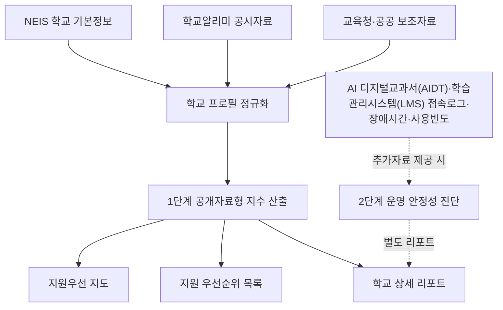

# AI 교육격차 지도 MVP 구성 검토서

작성일: 2026-05-24  
검토 대상: 공개자료 기반 AI 교육 지원우선순위 진단 MVP

## 1. 제품 한 줄 정의

**AI 교육격차 지도**는 학교를 평가하거나 순위화하는 서비스가 아니라, 공개자료로 확인 가능한 학교별 지원 필요 신호를 결합해 교육청과 학교가 먼저 살펴볼 지원 대상을 찾는 공공데이터 기반 MVP다.

## 2. 현재 제품 포지셔닝

### 핵심 관점

- 학교별 "AI 교육 수준"을 확정 평가하지 않는다.
- 공개자료만으로 측정 가능한 항목을 1단계 지수로 산출한다.
- AI 디지털교과서(AIDT)·학습관리시스템(LMS) 접속로그, 장애시간, 사용빈도는 현재 총점에 넣지 않는다.
- 학교·교육청 추가자료가 제공되면 2단계 확장진단으로 별도 산출한다.
- 데이터 신뢰도는 학교 역량이 아니라 판단의 확실성이므로 총점에서 분리한다.

### 제품 문장

> 학교별 학생·교원·시설·AI·SW 학습기회·지역 접근성을 결합해, 공개자료상 지원이 먼저 필요한 학교와 지원 유형을 보여줍니다.

### 피해야 할 해석

- "이 학교는 AI 교육을 못한다."
- "점수가 낮은 학교가 우수하다."
- "공개자료만으로 실제 수업 운영 수준을 확정할 수 있다."
- "AI 디지털교과서(AIDT)·학습관리시스템(LMS) 자료 없이 실제 디지털교과서 활용 안정성을 판단했다."

## 3. 전체 정보 구조

| 경로 | 화면명 | 역할 | 핵심 사용 상황 |
|---|---|---|---|
| `/` | 홈 | 제품 목적, 전체 현황, 주요 이동 버튼 | 처음 방문한 심사위원·검토자에게 방향 제시 |
| `/map` | 지원우선 지도 | 지도, 우선 지원 목록, 학교급·점수 구간 요약 | 공간 분포와 우선 검토 대상을 한 번에 확인 |
| `/priorities` | 지원 우선순위 | 집중 지원 대상 카드 목록 | 어떤 학교와 지원 유형을 먼저 볼지 검토 |
| `/schools/[id]` | 학교 상세 리포트 | 개별 학교 점수, 근거, 확장진단 슬롯 | 특정 학교의 판단 근거 확인 |
| `/data` | 데이터와 모델 | 산식, 데이터 신뢰도, 2단계 확장 모델 설명 | 방법론·데이터 범위 검토 |
| `/demo` | 3분 시연 모드 | 발표 흐름 요약 | 대회·심사 발표용 |

## 4. 1단계 공개자료형 지수

### 점수 방향

**점수가 높을수록 공개자료상 지원 필요 신호가 크다.**

이는 기존 "준비도 높음" 방식과 다르다. 현재 MVP는 준비가 잘된 학교를 찾는 도구가 아니라, 지원 필요 신호가 큰 학교를 찾는 도구다.

### 총점 구성

| 범주 | 배점 | 의미 | 주요 공개자료·대리지표 |
|---|---:|---|---|
| 교육 수요·취약 여건 | 25 | 학생 규모, 학급 부담, 교원 대비 학생 부담 | 학생 수, 학급 수, 학급당 학생 수, 학생-교원 비율 |
| 교원·운영 여건 | 20 | 교원이 AI·SW 수업을 운영할 여력 | 교원 수, 학생-교원 비율, 교원연수 대리지표 |
| 디지털·학습공간 기반 | 20 | 디지털·탐구형 학습을 위한 공간 기반 | 일반교실, 교과교실, 학습지원공간, 학생복지공간, 시설 신호 |
| AI·SW 학습기회 | 20 | 학생이 AI·SW 활동에 접근할 가능성 | 동아리 수, 방과후 프로그램, 참여 학생 수, AI·SW 프로그램 신호 |
| 지역 지원 접근성 | 15 | 학교 안팎 지원자원과 연계 가능성 | 지역센터, 상담·학습지원공간, 학생선택활동, 방과후 접근성 |
| 합계 | 100 | 공개자료 기반 지원우선 지수 |  |

### 등급 구간

| 구간 | 표시 용어 | 의미 | 색상 |
|---:|---|---|---|
| 45점 이상 | 집중 지원 | 공개자료상 먼저 살펴볼 지원 필요 신호가 큼 | 빨강 |
| 30점 이상 45점 미만 | 보완 우선 | 일부 영역 보강 검토 필요 | 주황 |
| 30점 미만 | 현행 유지 | 공개자료상 긴급 지원 신호는 상대적으로 낮음 | 파랑 |

현재 데이터 기준 분포:

| 구간 | 학교 수 |
|---|---:|
| 집중 지원 | 9 |
| 보완 우선 | 71 |
| 현행 유지 | 20 |

## 5. 데이터 신뢰도 처리

### 결론

**데이터 신뢰도는 총점에서 제외하고, 별도 배지로 표시한다.**

### 제외 이유

데이터 신뢰도는 학교의 AI 교육 여건이 아니라, 이 MVP가 해당 학교를 얼마나 확실하게 해석할 수 있는지를 뜻한다. 이를 총점에 넣으면 다음 문제가 생긴다.

- 자료가 많이 공개된 학교가 실제보다 유리해질 수 있다.
- 자료가 적은 학교가 실제보다 취약하게 보일 수 있다.
- "학교 역량"과 "데이터 완전성"이 섞여 해석이 흐려진다.

### 표시 방식

| 신뢰도 | 표시 문구 | 의미 | 사용 방식 |
|---|---|---|---|
| A | 공개자료 충분 | 핵심 직접지표와 대리지표가 충분함 | 점수 비교 가능 |
| B | 일부 대리지표 | 일부 항목이 대리지표 또는 보조자료 기반임 | 해석주의 문구 병기 |
| C | 추가확인 필요 | 핵심 항목 결측이 많음 | 순위보다 현장 확인 우선 |

### 화면 배치

- 학교 상세 점수 카드 상단: `신뢰도 A/B/C · 표시 문구`
- 점수 근거 카드 우측: 총점 산출 아래에 신뢰도 재표시
- `/data`: "데이터 신뢰도는 총점에 넣지 않는다"는 원칙 설명

## 6. 2단계 확장진단: AI 디지털교과서(AIDT)·학습관리시스템(LMS) 활용 안정성

### 설계 원칙

AI 디지털교과서(AIDT)·학습관리시스템(LMS) 로그는 좋은 지표지만 공개 공공데이터로 보기 어렵다. 따라서 현재 MVP 총점에는 반영하지 않고, 자료 제공 시 별도 리포트로 붙인다.

### 확장진단 범주

| 범주 | 배점 후보 | 필요 데이터 | 해석 |
|---|---:|---|---|
| 접속·가동 안정성 | 30 | 가동률, 로그인 성공률, 접속 실패율 | 수업 중 안정적으로 접속 가능한가 |
| 장애·복구 대응 | 25 | 장애건수, 누적 장애시간, 평균 복구시간 | 장애 발생 후 빠르게 회복되는가 |
| 사용 지속성 | 25 | 주간·월간 사용빈도, 적용 수업일수 | 일회성 도입이 아니라 지속적으로 쓰이는가 |
| 적용 범위 | 20 | 적용 학년·학급 비율, 대상 학생 커버리지 | 일부 학급이 아니라 실제 운영 범위가 넓은가 |

### 현재 화면 반영

- `/schools/[id]`: `2단계 확장진단` 섹션에 AI 디지털교과서(AIDT)·학습관리시스템(LMS) 활용 안정성 슬롯 표시
- `/data`: 확장진단의 네 가지 데이터 범주 표시
- 현 상태 배지: `자료 미연계`

## 7. 화면별 구성과 디자인 배치

## 홈

목적: 첫 화면에서 "무엇을 하는 서비스인지"와 "어디로 가야 하는지"를 즉시 이해시키는 화면.

구성:

1. 상단 헤더
   - 제품명: AI 교육격차 지도
   - 보조문구: 지원 우선순위 진단 MVP
   - 메뉴: 홈, 격차지도, 지원 우선순위, 데이터, 3분 시연
2. 페이지 헤더
   - 배지: 교육 공공데이터 AI 활용대회 MVP
   - 제목: AI 교육격차 지도
   - 설명: 공개자료상 지원이 먼저 필요한 학교와 지원 유형
3. KPI 카드 4개
   - 분석 학교
   - 지원 우선 검토
   - 보완 필요
   - 데이터 경고
4. 설명 카드
   - 배지: 1단계 공개자료형
   - 제목: 학교를 평가하지 않고, 지원 필요 신호를 찾습니다.
   - 본문: 공개자료형 지수와 AI 디지털교과서(AIDT)·학습관리시스템(LMS) 확장진단 분리 설명
   - CTA: 교육격차 지도 보기, 지원 우선순위 보기

디자인 메모:

- 첫 화면은 설명보다 KPI와 CTA가 먼저 보이도록 유지한다.
- 긴 방법론은 홈에 두지 않고 `/data`로 이동시킨다.
- "핵심 메시지" 같은 발표용 라벨은 쓰지 않는다.

## 지도

목적: 학교별 위치와 지원우선 구간을 공간적으로 파악하는 화면.

구성:

1. 페이지 헤더
   - 제목: 서울 A권역 지원우선 지도
   - 설명: 수요, 교원·운영, 학습공간, AI·SW 학습기회, 지역 접근성 비교
2. 지도 카드
   - 좌측: Leaflet 기반 실제 지도
   - 우측: 우선 확인 목록, 점수 구간, 학교급 집계
3. 우선 지원 상세 목록
   - 지원지수
   - 학교명
   - 학교급·주소
   - 보강 요인 배지
   - 권장 지원
4. 데이터 근거 패널
   - 정규화 학교
   - 좌표 매칭
   - 지원지수 산출
   - 지원 우선 검토
   - 점수 범위

디자인 메모:

- 지도는 큰 시각 요소이므로 상단 주요 위치를 차지한다.
- 빨강·주황·파랑은 구간 의미가 명확해야 한다.
- "높은 점수 = 더 잘함"으로 오해하지 않도록 `지원지수`라는 라벨을 쓴다.

## 지원 우선순위

목적: 집중 지원 학교와 지원 유형을 카드 형태로 빠르게 검토하는 화면.

구성:

1. 페이지 헤더
   - 제목: 먼저 살펴볼 학교와 지원 유형
   - 설명: 공개자료상 어떤 보강이 먼저 필요한지 찾기 위한 신호
2. 지원 카드
   - 카드 배지: 대표 보강 범주
   - 제목: 학교명
   - 설명: 우선 검토 영역
   - 액션: 추천 지원 방향

디자인 메모:

- 학교를 "문제 학교"처럼 보이게 하지 않는다.
- 카드는 "지원 방향" 중심으로 읽히게 한다.
- 지원 대상 여부는 확정이 아니라 검토 단계로 표현한다.

## 학교 상세 리포트

목적: 개별 학교의 점수, 근거, 한계, 다음 검토 항목을 보여주는 화면.

구성:

1. 페이지 헤더
   - 제목: `{학교명} 지원우선 리포트`
   - 설명: 학교 평가가 아니라 공개자료 기반 초기 진단
2. 좌측 점수 카드
   - 공개자료 지원우선 지수
   - 학교명
   - 신뢰도 배지
   - 등급 배지
   - 총점
   - 핵심 신호 3개
3. 우측 학교 기본정보
   - 주소
   - 교육지원청
   - 학생 수
   - 교원 수
   - 전화
   - 홈페이지
4. 점수 근거 표
   - 5개 범주
   - 보강 필요도
   - 반영 점수
   - 판단 이유
5. AI 디지털교과서(AIDT)·학습관리시스템(LMS) 확장진단 슬롯
   - 자료 미연계 배지
   - 접속·가동
   - 장애·복구
   - 사용 지속성
   - 적용 범위
6. 추천 지원 방향
   - 공개자료 기반 보강 방향
   - 지원 대상 여부 검토
   - 관련 사업 확인
   - 학교 의견 수렴

디자인 메모:

- 점수 카드와 기본정보를 2열로 배치해 첫 화면에서 핵심과 맥락을 동시에 보여준다.
- 점수 근거는 표로 두어 방어 가능성을 높인다.
- AI 디지털교과서(AIDT)·학습관리시스템(LMS)는 "자료 미연계" 상태를 숨기지 않는다.

## 데이터와 모델

목적: 심사위원·검토자가 산식, 데이터 범위, 한계를 확인하는 화면.

구성:

1. 페이지 헤더
   - 제목: 데이터는 이렇게 사용합니다
   - 설명: 1단계 공개자료형, 2단계 추가자료형 구분
2. KPI 카드
   - 정규화 학교
   - 지원지수 산출
   - 데이터 경고
3. 데이터 사용 패널
   - 교육 공공데이터
   - 1단계 산식
   - 신뢰도 배지
   - 2단계 확장
4. 지수 산식
   - 5개 범주와 배점
   - 신뢰도 총점 제외 이유
5. 2단계 확장진단 슬롯
   - AI 디지털교과서(AIDT)·학습관리시스템(LMS) 운영 안정성 지표

디자인 메모:

- 이 화면은 긴 설명이 허용되지만, 표와 카드 중심으로 유지한다.
- "왜 데이터 신뢰도를 점수에 넣지 않았는가"를 명시한다.
- 한계는 변명처럼 보이지 않게 확장 로드맵과 함께 보여준다.

## 3분 시연 모드

목적: 발표 흐름을 압축해서 보여주는 화면.

시연 흐름:

1. 문제: 공개자료만으로도 지원 우선순위를 먼저 가릴 필요
2. 데이터: NEIS, 학교알리미, 교육통계, 교육청 공개자료
3. 진단: 교육 수요, 교원·운영, 학습공간, AI·SW 학습기회, 지역 접근성
4. 확장: AI 디지털교과서(AIDT)·학습관리시스템(LMS) 로그 제공 시 별도 운영 안정성 진단
5. 효과: 학교 평가가 아니라 지원 우선순위 결정 지원

디자인 메모:

- 발표용 슬로건보다 실제 서비스 흐름을 보여준다.
- 마지막 CTA는 `/map`으로 보낸다.

## 8. 용어 체계

### 사용 용어

| 용어 | 의미 | 사용 위치 |
|---|---|---|
| AI 교육격차 지도 | 제품명 | 전역 |
| 공개자료 지원우선 지수 | 1단계 총점 | 점수 카드, 상세 리포트 |
| 지원우선 지수 | 짧은 라벨 | 지도, 목록, KPI |
| 집중 지원 | 45점 이상 | 구간 배지 |
| 보완 우선 | 30~44점 | 구간 배지 |
| 현행 유지 | 30점 미만 | 구간 배지 |
| 공개자료형 점수 | AI 디지털교과서(AIDT)·학습관리시스템(LMS) 미포함 1단계 점수 | 상세 리포트 |
| 데이터 신뢰도 | 판단 확실성 배지 | 상세 리포트, 데이터 페이지 |
| 2단계 확장진단 | 추가자료 제공 시 별도 진단 | 상세 리포트, 데이터 페이지 |
| AI 디지털교과서(AIDT)·학습관리시스템(LMS) 활용 안정성 | 접속·장애·사용빈도 기반 확장지표 | 상세 리포트, 데이터 페이지 |

### 피해야 할 용어

| 피할 용어 | 이유 | 대체어 |
|---|---|---|
| AI 교육 준비도 | 높을수록 좋은 점수로 오해 가능 | 지원우선 지수 |
| 학교 평가 | 서열화·낙인 우려 | 지원 필요 신호 |
| 낮은 학교 | 가치판단처럼 보임 | 보강 검토 대상 |
| 부실 학교 | 금지 | 집중 지원 |
| AI가 판단 | 과도한 자동판정 인상 | 공개자료 기반 산출 |
| 확정 추천 | 행정 결정으로 오해 | 지원 방향, 검토 대상 |
| 실제 수업 수준 | 현재 공개자료만으로는 확정 불가 | 공개자료상 학습기회 신호 |

## 9. 디자인 시스템 메모

### 레이아웃

- 전체 폭: `max-w-7xl`
- 본문 여백: `px-4 py-8`
- 카드 반경: 기존 구현은 `rounded-2xl`, 지도 큰 카드 일부 `rounded-lg`
- 카드 배경: 흰색, 보조 정보는 `slate-50`
- 섹션 간격: `space-y-8`, 카드 내부 `p-5` 또는 `p-6`

### 색상 의미

| 색 | 의미 |
|---|---|
| 빨강 | 집중 지원 |
| 주황 | 보완 우선 |
| 파랑 | 현행 유지, 일반 정보, 주요 CTA |
| 회색 | 보조 정보, 데이터 신뢰도, 자료 미연계 |

### 카드 사용 원칙

- 카드 안에 또 다른 큰 카드를 중첩하지 않는다.
- 반복 항목, KPI, 리포트 블록에만 카드 사용.
- 긴 문단은 카드 제목, 짧은 설명, 표 또는 배지로 분해한다.

### 버튼·CTA

| CTA | 위치 | 목적 |
|---|---|---|
| 교육격차 지도 보기 | 홈 | 주요 탐색 시작 |
| 지원 우선순위 보기 | 홈 | 목록 기반 검토 |
| 데이터 근거 보기 | 상세 | 산식·출처 확인 |
| 시연 시작 | 3분 시연 | 발표 흐름에서 지도 이동 |

## 10. 데이터 흐름

## 11. 데이터 출처 구분

| 출처 유형 | 현재 역할 | 화면 표시 |
|---|---|---|
| NEIS | 학교 기본정보, 주소, 학교급, 연락처 | 기본정보, 지도 좌표 매칭 |
| 학교알리미 | 학생·교원·시설·프로그램 대리지표 | 점수 산식, 상세 근거 |
| 교육통계·교육청 공개자료 | 지역·보조 기준 | 지역 접근성, 보완 자료 |
| 학교·교육청 추가자료 | 현재 미연계 | 2단계 확장진단 슬롯 |
| AI 디지털교과서(AIDT)·학습관리시스템(LMS) 로그 | 현재 미연계 | 운영 안정성 확장지표 |

## 12. 검토 포인트

### 제품 방향

- [ ] "지원우선 지수"가 학교 평가가 아니라는 점이 충분히 전달되는가
- [ ] 점수가 높을수록 지원 필요가 크다는 방향이 명확한가
- [ ] AI 디지털교과서(AIDT)·학습관리시스템(LMS)를 현재 총점에서 제외한 이유가 납득되는가
- [ ] 데이터 신뢰도를 총점에서 분리한 결정이 화면에서 잘 보이는가

### 데이터·산식

- [ ] 5개 범주 배점이 MVP 목적에 맞는가
- [ ] AI·SW 학습기회가 공개자료 대리지표임을 충분히 설명하는가
- [ ] 지역 지원 접근성 산식이 과도하게 추정처럼 보이지 않는가
- [ ] 결측이 많은 학교를 별도 검토 대상으로 다룰 수 있는가

### UI·문구

- [ ] 첫 화면에서 제품 목적, 현재 상태, 다음 클릭이 보이는가
- [ ] 지도에서 구간 색상과 점수 방향이 헷갈리지 않는가
- [ ] 상세 리포트에서 근거와 한계가 한눈에 보이는가
- [ ] "준비도", "평가", "확정 추천" 같은 오해 소지가 남아 있지 않은가

### 발표·심사 대응

- [ ] 3분 시연에서 문제-데이터-진단-확장-효과 흐름이 자연스러운가
- [ ] 공개자료만으로 가능한 범위와 추가자료가 필요한 범위가 분리되어 있는가
- [ ] "실제 수업 질"을 직접 평가하지 않는다는 한계가 명확한가

## 13. 다음 개선 후보

1. 데이터 신뢰도 C 학교의 순위 표시 제한 또는 별도 필터 추가
2. 학교 상세 리포트에서 `직접지표`와 `대리지표` 배지 분리
3. 지도 우측 패널에 TOP 3 집중 지원 학교를 별도 고정
4. AI 디지털교과서(AIDT)·학습관리시스템(LMS) 샘플 스키마 문서 추가
5. `/data`에 산식별 최소·목표 기준값 표 추가
6. 학교급별 가중치 차등 적용 검토

## 14. 현재 상태 요약

- 대상: 서울 A권역 학교 100개
- 1단계 지수: 공개자료 기반 지원우선 지수
- 점수 구간: 집중 지원 9개, 보완 우선 71개, 현행 유지 20개
- 데이터 신뢰도: 총점 제외, A/B/C 배지 표시
- AI 디지털교과서(AIDT)·학습관리시스템(LMS): 총점 제외, 2단계 확장진단 슬롯으로 표시
- 검증 상태: 타입체크 통과, Next 빌드 통과, 주요 경로 렌더 확인

